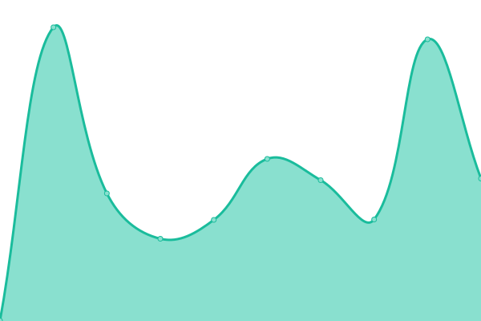

# [📈 Live Status](https://ezequieleal06-tech.github.io/rapiseeds-status): <!--live status--> **Todos los sistemas operativos**

This repository contains the open-source uptime monitor and status page for [ezequieleal06-tech](https://ezequieleal06-tech.github.io/rapiseeds-status), powered by [Upptime](https://github.com/upptime/upptime).

With [Upptime](https://upptime.js.org), you can get your own unlimited and free uptime monitor and status page, powered entirely by a GitHub repository. We use [Issues](https://github.com/ezequieleal06-tech/rapiseeds-status/issues) as incident reports, [Actions](https://github.com/ezequieleal06-tech/rapiseeds-status/actions) as uptime monitors, and [Pages](https://ezequieleal06-tech.github.io/rapiseeds-status) for the status page.

<!--start: status pages-->
<!-- This summary is generated by Upptime (https://github.com/upptime/upptime) -->
<!-- Do not edit this manually, your changes will be overwritten -->
<!-- prettier-ignore -->
| URL | Estado | History | Tiempo de respuesta | Uptime |
| --- | ------ | ------- | ------------- | ------ |
|  [RapiSeeds Web](https://rapiseeds.com) | 🟩 Up | [rapi-seeds-web.yml](https://github.com/ezequieleal06-tech/rapiseeds-status/commits/HEAD/history/rapi-seeds-web.yml) | 

 417ms
     
 | 

<a href="https://status.rapiseeds.com/history/rapi-seeds-web">100.00%</a>
    

|  [RapiSeeds www](https://www.rapiseeds.com) | 🟩 Up | [rapi-seeds-www.yml](https://github.com/ezequieleal06-tech/rapiseeds-status/commits/HEAD/history/rapi-seeds-www.yml) | 

 303ms
     
 | 

<a href="https://status.rapiseeds.com/history/rapi-seeds-www">100.00%</a>
    

|  [Supabase API](https://abpasdyraaihdysvexiw.supabase.co/rest/v1/) | 🟩 Up | [supabase-api.yml](https://github.com/ezequieleal06-tech/rapiseeds-status/commits/HEAD/history/supabase-api.yml) | 

 125ms
     
 | 

<a href="https://status.rapiseeds.com/history/supabase-api">100.00%</a>
    

|  [n8n Webhooks](https://n8ntesting.online) | 🟩 Up | [n8n-webhooks.yml](https://github.com/ezequieleal06-tech/rapiseeds-status/commits/HEAD/history/n8n-webhooks.yml) | 

 227ms
     
 | 

<a href="https://status.rapiseeds.com/history/n8n-webhooks">100.00%</a>
    

<!--end: status pages-->

[**Visit our status website →**](https://ezequieleal06-tech.github.io/rapiseeds-status)

## 📄 License

- Powered by: [Upptime](https://github.com/upptime/upptime)
- Code: [MIT](./LICENSE) © [Anand Chowdhary](https://anandchowdhary.com), supported by [Pabio](https://pabio.com)
- Data in the `./history` directory: [Open Database License](https://opendatacommons.org/licenses/odbl/1-0/)
